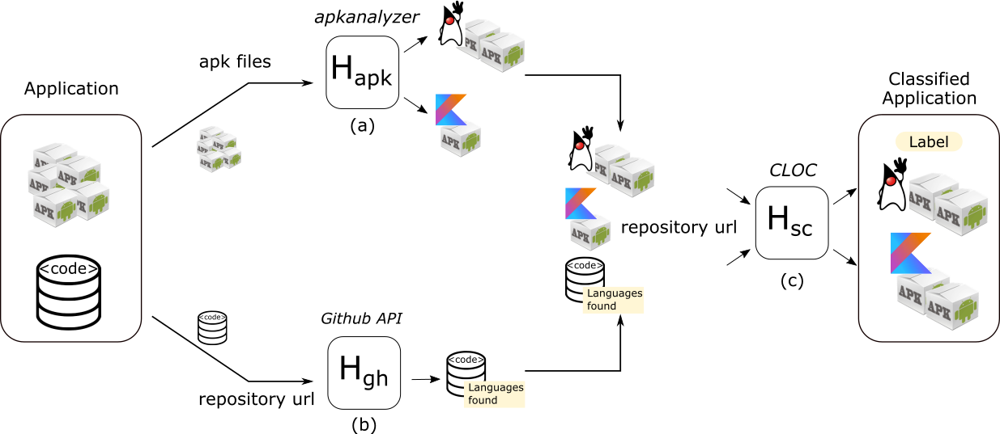

# An Empirical Study on Quality of Android Applications written in Kotlin language<a name="top"></a>
Here you can find the steps needed to replicate our study reliazed in our paper **An Empirical Study on Quality of Android Applications written in Kotlin language** published on [https://link.springer.com/article/10.1007%2Fs10664-019-09727-4](https://link.springer.com/article/10.1007%2Fs10664-019-09727-4).

If you want use this information, please cite this paper:

```latex
@Article{GóisMateus2019,
author="G{\'o}is Mateus, Bruno
and Martinez, Matias",
title="An empirical study on quality of Android applications written in Kotlin language",
journal="Empirical Software Engineering",
year="2019",
month="Jun",
day="25",
abstract="During the last years, developers of mobile applications have the possibility to use new paradigms and tools for developing mobile applications. For instance, since 2017, Android developers have the official support to write Android applications using Kotlin language. Kotlin is programming language fully interoperable with Java that combines object-oriented and functional features.",
issn="1573-7616",
doi="10.1007/s10664-019-09727-4",
url="https://doi.org/10.1007/s10664-019-09727-4"
}
```


---

## Table of contents 

1. [Creation of a dataset of Kotlin applications](#datasetconstruction)
	* [F-Droid](#fdroid)
	* [AndroidTimeMachine](#androidtimemachine)
	* [AndroZoo](#androzoo)
2. [Building our study dataset](#filtering)
	* [Getting applications from 2017 and 2018](#recentapps)
	* [Detecting Kotlin applications](#hs)
3. [Code evolution of Android applications](#codeevolution)
4. [Analyzing the difference between Kotlin and Java applications in terms of presence of code smells](#codesmells)
5. [Detecting changes in the quality evolution trends after introducing Kotlin](#quality)

---

### 1. Creation of a dataset of Kotlin applications <a name="datasetconstruction"></a>

As the goal of our experiment is to study the use and quality of Kotlin code in Android applications,
we decided to study mobile applications that have at least one version released on 2017 or later.
As [Kotlin was announced as an official language for Android development in 2017](https://android-developers.googleblog.com/2017/05/android-announces-support-for-kotlin.html), before that date Android developers did not have support from Google for developing Android applications using Kotlin language.
Therefore, we considered that applications whose last versions date from 2016 or earlier could not give us much information about the use of Kotlin language in the Android domain.

Moreover, we need that our dataset of Android applications includes, for each application: 

1.  its source code hosted in a code repository (e.g., GitHub), and 
2. binary files (apk) of the released versions. 


#### Selecting dataset of Android applications

We created our dataset of mobile applications by combining three already defined datasets: [F-droid](http://f-droid.org), [AndroidTimeMachine](https://androidtimemachine.github.io), and [AndroZoo](http://androzoo.uni.lu). To our knowledge those are the three largest publicly available datasets of Android applications that contain applications recently released. 

Let us now to introduce each dataset and to explain the reasons of choosing them. 

#### F-Droid <a name="fdroid"></a>

**F-droid** is a directory of open-source Android applications. All apps listed in this directory are compiled from source and code repositories are publicly linked. In total, F-droid has **1509** applications on **06/04/2018**.

F-droid provides all information we need, i.e, access to a code repository and apks of the different released versions of the applications. However, the number of applications **1509** is low compared with other datasets. For this reason, we decided to mine other Android datasets with the goal of including more applications in our study.

The table below shows some of these applications. To see the complete list click [here](docs/fdroid_all.md).

| App Name| Summary| Source-code Repo|
|---|---|---|
| 1. Aard| Offline dictionary| https://github.com/aarddict/android |
| 2. A2DP Volume| Manage Bluetooth functions| https://github.com/jroal/a2dpvolume |
| 3. A Time Tracker| Time Tracker| https://github.com/netmackan/ATimeTracker |
| 4. A Photo Manager| Manage local photos: Find/Copy/Edit-Exif and show in Gallery or Map.| https://github.com/k3b/androFotoFinder |
| 5. 34C3 Schedule| Schedule (aka FahrPlan) of the 34C3| https://github.com/EventFahrplan/EventFahrplan |
| 6. 33c3 Wifi Setup| Create secure Wifi connection entry for 33c3| https://github.com/eqvinox/wifisetup |
| 7. 33c3 SCR| Resolve Schedule conflicts| https://github.com/ligi/SCR |
| 8. 33C3 Schedule| Schedule (aka FahrPlan) of the 33C3| https://github.com/ligi/CampFahrplan |

F-droid provides on the main page of each application a link to download its last three versions and a link for another page with some technical information that contains all versions. 
**[Our crawler](https://github.com/brunomateus/f-droid-crawler)** is able to visit both pages for each application and retrieve the link to the apk for every version available. 


[back to the top](#top)

#### AndroidTimeMachine <a name="androidtimemachine"></a>

**AndroidTimeMachine** is a graph database of  Android apps which are both accessible on GitHub and Google.

In total, AndroidTimeMachine has **8431** applications and it is based on publicly-available GitHub mirror available in [BigQuery](https://cloud.google.com/bigquery/public-data/github) dated on 18th October 2018. Using the Neo4j database is possible to retrieve for each application its source-code repository link and the application's package name. However, this dataset does not provide any apks from its applications.
For this reason, we decided to mine the missing apks on AndroZoo dataset. 

The table below shows some of these applications. To see the complete visit the [official website](https://androidtimemachine.github.io).

| Source-code repo| Package name|
|---|---|
|1. https://github.com/learn-mobile-16/QuakeBuddy |com.gumgoose.app.quakebuddy |
|2. https://github.com/bigeyessolution/FestivalEdesio |com.bigeyessolution.FestivalEdesio |
|3. https://github.com/tarek360/PlayPauseDrawable |com.tarek360.playpausedrawable |
|4. https://github.com/gwhiteside/abstract-art |net.georgewhiteside.android.abstractart |
|5. https://github.com/shaun2029/ClockControl |uk.co.immutablefix.ClockControl |
|6. https://github.com/eziosoft/MultiWii_EZ_GUI |com.ezio.multiwii |
|7. https://github.com/jakemoritz/Tasking |me.jakemoritz.tasking_new | 
|8. https://github.com/meghalagrawal/NightSight |meghal.developer.nightsight.project |
|9. https://github.com/abbott221/WebsiteAndApp |com.MichaelAbbott.hexagonalgame |

This dataset is available in two different dockers: (i) first, containing the Neo4j database and (ii) second, containing a snapshot of all GitHub repositories in the dataset cloned to a local Gitlab.

[back to the top](#top)

#### AndroZoo <a name="androzoo"></a>

**AndroZoo** is dataset of millions of Android apps collected from various data sources using different web crawlers. The sources from which AndroZoo draws include major market places *Google Play, Anzhi, and AppChine*, as well as smaller directories mobile, *AnGeeks, Slideme, ProAndroid, HiApk*, and *F-Droid*.

In total, AndroZoo has **4390288** applications and **7795372** apks on **16/10/2018**. The list of available APKs is regularly updated on the AndroZoo website, along with metadata for each app as, the main package name, the size of the APK, the version, and the market where the app was downloaded from, etc . However, AndroZoo does not provide a link for the source-code repository of an application, even if an application is open-source.

The table below shows some of these applications. Each line corresponds to one apk file 

|Package name|Version code|Markets|Apk size in bytes|
|---|---|---|---|
|com.zte.bamachaye|121|anzhi|10386469|
|com.deperu.sitiosarequipa|10000|play.google.com|4300370|
|bmthx.god102409paperi|6|appchina|1044597|
|kr.ac.snjc.library|3|play.google.com|1375862|
|com.rbsoftware.pfm.personalfinancemanager|48|play.google.com|5345848|
|com.indoorway.android.fluctus|14|play.google.com|12798854|
|com.fearless.teengirl|3|play.google.com|4727630|
|com.appautomatic.ankulua.trial|39|play.google.com|16004883|
|com.kbf.app27730661|70101|play.google.com|1882706|


Furthermore, the AndroZoo's HTTP API allows to download full and unaltered APKs. 

[back to the top](#top)

---

### 2. Building our study dataset <a name="filtering"></a>

Now, we present the different steps to build the dataset used in this study.

In this work, we are interested in a subset of mobile applications from F-droid, AndroidTimeMachine and AndroZoo: those that contain Kotlin code.

As Kotlin was announced as an official language for Android development in 2017, before that date, Android developers did not have support from Google for developing Android apps using Kotlin language.

Therefore, we consider that apps which the last versions date from 2016 or earlier could not give us much information about the use of Kotlin language in the Android domain.
Consequently, the criterion we used for building our dataset of mobile apps is to select every application whose last version was released in 2017 or later.

#### Getting applications from 2017 and 2018 <a name="recentapps"></a>


##### Step 1: Mining F-Droid


Using the upload version provided by F-Droid, total number of applications retrieved from F-Droid by the date of June 4th, 2018 that fulfill our selection criterion is **928** 

The table below shows some of these applications. To see the complete list click [here](docs/fdroid_2017_2018.md).

|App name| Pakcage Name| Description | Upload Date | Source-code repo|
|---|---|---|---|---|
|1.A Photo Manager|de.k3b.android.androFotoFinder|Manage local photos: Find/Copy/Edit-Exif and show in Gallery or Map.|2018-03-23|https://github.com/k3b/androFotoFinder|
|2.34C3 Schedule|info.metadude.android.congress.schedule|Schedule (aka FahrPlan) of the 34C3|2018-01-03|https://github.com/EventFahrplan/EventFahrplan|
|3.1010! Klooni|io.github.lonamiwebs.klooni|libGDX game based on 1010|2018-02-06|https://github.com/LonamiWebs/Klooni1010|
|4.Additional Security Settings|com.davidshewitt.admincontrol|Additional security settings|2018-03-23|https://github.com/linux-colonel/AdminControl|
|5.AnySoftKeyboard - French Language Pack|com.anysoftkeyboard.languagepack.french|AnySoftKeyboard French Language pack|2018-03-23|https://github.com/AnySoftKeyboard/LanguagePack/tree/French|
|6.AnySoftKeyboard|com.menny.android.anysoftkeyboard|Alternative keyboard|2018-03-05|https://github.com/AnySoftKeyboard/AnySoftKeyboard|
|7.AntennaPod|de.danoeh.antennapod|Advanced podcast manager and player|2018-04-16|https://github.com/antennapod/AntennaPod|
|8.Another RSS|de.digisocken.anotherrss|reader for multiple RSS feeds in a single, searchable list|2018-05-23|https://github.com/no-go/AnotherRSS|

However,
we retrieved **926** applications, since we could not download apks from two applications ([app1](https://f-droid.org/en/packages/org.fdroid.fdroid.privileged.ota/) [app2](https://f-droid.org/en/packages/org.fdroid.fdroid.ota/)), because for these applications F-Droid provides only zip files. Moreover, the total number of versions (i.e., apks) found corresponding to those applications was **13094**. 
We could download **11675** apks (**89%**). The rest of apks files (**11%**) were not available.  

##### Step 2: Mining AndrodTimeMachine

The version of  AndroidTimeMachine  presented by its authors  contains **8431** applications and it has been executed in October 2017. As their infrastructure is publicly available,[dataset](https://androidtimemachine.github.io/dataset) and [tool](https://github.com/AndroidTimeMachine/open_source_android_apps),
we re-executed it on October 2018 with the goal of including more recent applications.

Once we retrieved the list of applications, 
as difference of the original work we carried out a new step to keep applications whose code repository that have only one Android manifest file.

We discovered that their technique for linking code repositories of a mobile application with the corresponding Google Play page can fail if the app repository has more than one manifest. 

The table below shows the comparison between the numbers found by us resulting of the re-execution of each step and the numbers of the original dataset by Geiger2018:data. In conclusion, we retained  **2156** applications from AndroidTimeMachine, all of them fulfill our selection criterion. 

<table class="tg">
  <tr>
    <td class="tg-xldj" rowspan="2">Steps</td>
    <td class="tg-uys7" colspan="2">AndroidTimeMachine</td>
  </tr>
  <tr>
    <td class="tg-c3ow">Original</td>
    <td class="tg-c3ow">Updated</td>
  </tr>
  <tr>
    <td class="tg-0pky">1. Finding Android Manifest Files</td>
    <td class="tg-c3ow">378610</td>
    <td class="tg-c3ow">358518</td>
  </tr>
  <tr>
    <td class="tg-0pky">2. Extracting package Names</td>
    <td class="tg-c3ow">112153</td>
    <td class="tg-c3ow">114152</td>
  </tr>
  <tr>
    <td class="tg-0pky">3. Discarding repositories with more than one manifest file</td>
    <td class="tg-c3ow">-</td>
    <td class="tg-c3ow">49570</td>
  </tr>
  <tr>
    <td class="tg-0pky">4. Filtering applications on Google Play</td>
    <td class="tg-c3ow">9478</td>
    <td class="tg-c3ow">3664</td>
  </tr>
  <tr>
    <td class="tg-0pky">5. Matching of Google Play pages to GitHub repositories</td>
    <td class="tg-c3ow">8431</td>
    <td class="tg-c3ow">3664</td>
  </tr>
  <tr>
    <td class="tg-0pky">6. Filtering applications from 2017 or later</td>
    <td class="tg-c3ow">-</td>
    <td class="tg-c3ow">2156</td>
  </tr>
</table>


The table below shows some of these applications that fullfil our criterion. To see the complete list click [here](docs/androidtimemachine_2017_2018.md).

App name| Package Name| Description | Upload Date | Source-code repo|
|---|---|---|---|---|
|1. 10,000 sentences|info.puzz.a10000sentences|10,000 sentences will help you learn new words in languages you are learning.|Jan 27, 2018|https://github.com/tkrajina/10000sentences|
|2. 10-bit Clock Widget|com.github.ashutoshgngwr.tenbitclockwidget|View your home screen clock in bits.|Oct 22, 2017|https://github.com/ashutoshgngwr/10-bitClockWidget|
|3. 104 Birds Quiz|net.project104.civyshkbirds|Game to identify birds from their picture or their singings|Jun 3, 2017|https://github.com/civyshk/104birds|
|4. 104 RPN Calc|net.project104.civyshkrpncalc|Calc that successfully merges the Reverse Polish Notation and the Infix Notation|Jun 19, 2018|https://github.com/CIVYSH/rpncalc104k|
|5. 106/109ハードウェアキーボード配列変更(+親指Ctrl)|jp.kcm.thumbctrl|日本語ハードウェアキーボード用に日本語配列を追加. ([半/全]と[ESC]入替、[変換]/[無変換]→[Ctrl]、[Caps]→[半/全]も追加されます)|Jun 13, 2018|https://github.com/shiftrot/ThumbCtrl|
|6. 10Sel|com.app.android.tensel|peer to peer mobile commerce. Sell and request stuff with peers around you|Sep 7, 2017|https://github.com/Nguedia-Adele/J_Trok|
|7. 15 Puzzle Game - Photo Edition|de.fintasys.the_15_puzzle_game|Use your photos from Instagram or from your device to play the 15-Puzzle-Game!|Mar 30, 2017|https://github.com/Fintasys/15-Puzzle-Game|
|8. 2048 (Ads Free)|com.tpcstld.twozerogame|Port of Gabriele Cirulli's 2048 to Android.\n\n+No Ads!\n+No permissions!|Jun 10, 2018|https://github.com/BuddyBuild/2048-Android|
|9. 5 Calls|org.a5calls.android.a5calls|Make your voice heard: Spend 5 minutes, make 5 calls.|Jul 18, 2018|https://github.com/bryansills/5calls-android|
|10. 5 Pin Bowling Companion|ca.josephroque.bowlingcompanion|Track 5 pin bowling scores frame-by-frame, along with a medley of statistics!|Sep 29, 2018|https://github.com/sunndog/bowling-companion|

The table below shows the false/positive avoided by our incluision of a new step, step 3.

|Repo URL|Package|App on Google Play| 
|---|---|---|
[FinalHerramientas-2014-2](https://github.com/afmurillo/FinalHerramientas-2014-2)| com.google.android.apps.googlevoice|[Google Voice](https://play.google.com/store/apps/details?id=com.google.android.apps.googlevoice)|
[FinalHerramientas-2014-2](https://github.com/afmurillo/FinalHerramientas-2014-2)| com.google.android.gm|[Gmail](https://play.google.com/store/apps/details?id=com.google.android.gm)|
[MIUI-XML-6.0-Indonesian](https://github.com/bamz3r/MIUI-XML-6.0-Indonesian)|com.google.android.music|[Google Music](https://play.google.com/store/apps/details?id=com.google.android.music)|
[react-native-navigation](https://github.com/travelbird/react-native-navigation)|com.airbnb.android|[Airbnb](https://play.google.com/store/apps/details?id=com.airbnb.android)|
|[foursquared.eclair](https://github.com/sbolisetty/foursquared.eclair)|com.joelapenna.foursquared|[Foursquare](https://play.google.com/store/apps/details?id=com.joelapenna.foursquared)|

##### Step 3: Combining AndrodTimeMachine with AndroZoo and F-Droid

Using the packages names of each app, we queried the csv file provided by AndroZoo to identify which applications we could download the apks. Then, we found **236** applications present on F-Droid as well, remaining  **1295**  applications  to  download. Then, we  checked  manually  for  each  of  1295  applications, its pages on GooglePlay and its source-code link, to avoid applications liked with wrong repositories, including applications not open-source, because this would result on downloading wrong apks. We found and removed 54 applications, including some not open-source apps, as Facebook Mensseger  and Twitter.  The  complete  list  of  apps  removed  is  available [here](docs/wrong_match.md).


The table below shows some of these applications. To see the complete list click [here](docs/androidtimemachine_androzoo.md) and to see the intersection between the datasets click [here](docs/intersection.md).

|App name| Package Name| Description | Upload Date | Source-code repo|
|---|---|---|---|---|
|1. 10,000 sentences|info.puzz.a10000sentences|10,000 sentences will help you learn new words in languages you are learning.|Jan 27, 2018|https://github.com/tkrajina/10000sentences|
|2. 104 RPN Calc|net.project104.civyshkrpncalc|Calc that successfully merges the Reverse Polish Notation and the Infix Notation|Jun 19, 2018|https://github.com/CIVYSH/rpncalc104k|
|3. 106/109ハードウェアキーボード配列変更(+親指Ctrl)|jp.kcm.thumbctrl|日本語ハードウェアキーボード用に日本語配列を追加. ([半/全]と[ESC]入替、[変換]/[無変換]→[Ctrl]、[Caps]→[半/全]も追加されます)|Jun 13, 2018|https://github.com/shiftrot/ThumbCtrl|
|4. 2048 (Ads Free)|com.tpcstld.twozerogame|Port of Gabriele Cirulli's 2048 to Android.\n\n+No Ads!\n+No permissions!|Jun 10, 2018|https://github.com/BuddyBuild/2048-Android|
|5. 5 Calls|org.a5calls.android.a5calls|Make your voice heard: Spend 5 minutes, make 5 calls.|Jul 18, 2018|https://github.com/bryansills/5calls-android|
|6. 5 Pin Bowling Companion|ca.josephroque.bowlingcompanion|Track 5 pin bowling scores frame-by-frame, along with a medley of statistics!|Sep 29, 2018|https://github.com/sunndog/bowling-companion|
|7. A Mohammed Khaleel’s Invitation|com.slbdev.demo|A Mohammed Khaleel’s Invitation|Aug 9, 2018|https://github.com/alexrainman/CarouselView|
|8. A.scribe|com.laaidback.ascribe|open-source, minimalist note-taking app|Aug 3, 2017|https://github.com/Laaidback/A.scribe|

#### The resulting dataset 

Our final dataset, named **FAMAZOA** - **F**-droid **A**ndroidtime**M**achine **A**ndroZoo **O**pen-source **A**pplications) corresponds to:  

**F-droid &cup; ( AndroZoo &cap; AndroidTimeMachine)**

In total, our dataset should have **2169** (928 + 1241) applications, but we could not download any apks from two applications, then our final dataset has **2167** apps and **19838** apks. 

The table below shows some of these applications. To see the complete list click [here](docs/final_dataset.md).

|App name| Package Name| Description | Upload Date | Source-code repo|
|---|---|---|---|---|
|1. 10,000 sentences|info.puzz.a10000sentences|10,000 sentences will help you learn new words in languages you are learning.|Jan 27, 2018|https://github.com/tkrajina/10000sentences|
|2. 104 RPN Calc|net.project104.civyshkrpncalc|Calc that successfully merges the Reverse Polish Notation and the Infix Notation|Jun 19, 2018|https://github.com/CIVYSH/rpncalc104k|
|3. 106/109ハードウェアキーボード配列変更(+親指Ctrl)|jp.kcm.thumbctrl|日本語ハードウェアキーボード用に日本語配列を追加. ([半/全]と[ESC]入替、[変換]/[無変換]→[Ctrl]、[Caps]→[半/全]も追加されます)|Jun 13, 2018|https://github.com/shiftrot/ThumbCtrl|
|4. 2048 (Ads Free)|com.tpcstld.twozerogame|Port of Gabriele Cirulli's 2048 to Android.\n\n+No Ads!\n+No permissions!|Jun 10, 2018|https://github.com/BuddyBuild/2048-Android|
|5. 5 Calls|org.a5calls.android.a5calls|Make your voice heard: Spend 5 minutes, make 5 calls.|Jul 18, 2018|https://github.com/bryansills/5calls-android|
|6. 5 Pin Bowling Companion|ca.josephroque.bowlingcompanion|Track 5 pin bowling scores frame-by-frame, along with a medley of statistics!|Sep 29, 2018|https://github.com/sunndog/bowling-companion|
|7. A.scribe|com.laaidback.ascribe|open-source, minimalist note-taking app|Aug 3, 2017|https://github.com/Laaidback/A.scribe|
|8. AES Crypto|com.evgenii.aescrypto|Encrypt your message with one tap.|Sep 21, 2018|https://github.com/evgenyneu/aes-crypto-android|
|9. APC UPS Countdown|net.formula97.android.apcupscountdown|APC by Schneider ElectricのUPSで表示される時間情報の計算を補助する|Aug 10, 2018|https://github.com/f97one/ApcUpsCountdown|
|10. APK Downloader|ca.barraco.carlo.apkdownloader|Save apps installed on your device to an APK file in your Download folder.|Jun 28, 2018|https://github.com/cbarox/APK-Downloader|


[back to the top](#top)

The figure below shows the distribution of apks (released versions) per applications. From F-droid we downloaded in median 6 apks, 
and from AndroidZoo we downloaded in media 3 apk per application.


#### Detecting Kotlin applications<a name="hs"></a>

We build a process to classify both applications and apks retrieved in two categories of applications: (1) written (partially or totally) with Kotlin, and (2) written with Java (not include any line of Kotlin code).

The Figure below shows the process for classifying applications between Kotlin and Java based, which has 3 main steps.



We  first applied an heuristics *H_apk*, that consists of looking for a folder called **kotlin** inside the apk file. Having such folder is an evidence of having Kotlin code inside the application.  
To automatize this task,  a tool named *apkanalyzer* included in the Android SDK. Using this heuristic, we first classified each version (apk) of an application.Then, if at least one apk of an application is classified as Kotlin, the heuristic  classified  the application as *Kotlin*. Otherwise, it classifies as *Java*.
The *H_apk* provides a cheap and fast approach to get an initial guess about the presence of Kotlin code.

At the same time, we applied our second heuristic *H_gh*, which relies on the GitHub API:  for each application hosted on GitHub, we queried the GitHub API to retrieve the amount of code (expressed in bytes) from the most recent version (i.e., the HEAD) grouped by programming language. We classified the app as `Kotlin' if Kotlin language is present in the response of the API. The input of this heuristic is a URL to a GitHub repository.

Finally, once we retrieved a set of candidate Kotlin applications using *H_apk* and *H_gh*, i.e, ***H\_apk &cup; H\_gh***,
we checked manually the applications repositories to avoid duplicated repositories, i.e, repositories that contain more than one application, we applied the heuristic *H_sc* over them, to assert the presence of Kotlin code and to measure how much Kotlin an application has.  The heuristic *H_sc* inspected every commit of the source code repository of an application.An application was classified as *Kotlin* if the heuristic found at least one commit that had Kotlin code,  and as `Pure Kotlin' if all commits contained only Kotlin code.


##### Results

The Table below summarizes the classification of applications  done using the methodology  presented before.

|Information|Total|Kotlin|Java|
|---|---|---|---|
|Unique apps|2167|244|1923|
|Versions|19838|1590|18248|

FAMAZOA has **2167** applications using our heuristics we classified **244 (11.26%)** as *Kotlin* applications. Consequently, the remaining applications, **1923 (88.74%)**, were classified as *Java*. 
The figure  below shows these percentages.  
Considering the number of versions (apk), we found 
1590 apks (8.01%) with Kotlin code and 
18248 (91.28%) without Kotlin code. 

**Unique apps**


**All versions**


Now, let us to explain how we arrived to detect 244 Kotlin applications from FAMAZOA. 

First, the heuristic *H_apk* classified 265 applications as *Kotlin*. Those applications have, at least, one apk classified as *Kotlin*. For 76 of them, all apks are classified as *Kotlin*.

  The table below shows some of these applications. To see the complete list click [here](docs/hapk.md).
 
|App name| Package Name| Description | Upload Date | Source-code repo|
|---|---|---|---|---|
|6. 5 Pin Bowling Companion|ca.josephroque.bowlingcompanion|Track 5 pin bowling scores frame-by-frame, along with a medley of statistics!|Sep 29, 2018|https://github.com/sunndog/bowling-companion|
|9. APC UPS Countdown|net.formula97.android.apcupscountdown|APC by Schneider ElectricのUPSで表示される時間情報の計算を補助する|Aug 10, 2018|https://github.com/f97one/ApcUpsCountdown|
|14. Accounting Fantozzi|com.eusecom.samfantozzi|Android mobil accounting Fantozzi complete accounting for smartphone and tablet.|Jun 21, 2018|https://github.com/eurosecom/samfantozzi|
|18. Adblock Fast|com.rocketshipapps.adblockfast|Adblock Fast is a free, open-source ad blocker for Samsung Internet 4.0 and up!|May 17, 2017|https://github.com/rocketshipapps/adblockfast|
|45. Ad-Free|ch.abertschi.adfree|AdBlocker for Spotify|2018-02-16|https://github.com/abertschi/ad-free|
|59. Always On AMOLED - BETA|com.tomer.alwayson|Get an always on display on your device!|May 20, 2018|https://github.com/rosenpin/AlwaysOnDisplayAmoled|
|79. Android Playground|com.esafirm.androidplayground|Android Playground|Jan 3, 2018|https://github.com/esafirm/android-playground|
|85. AnkiEditor for AnkiDroid|com.jkcarino.ankieditor|An advanced note editor plug-in for AnkiDroid|Sep 29, 2018|https://github.com/jkennethcarino/AnkiEditor|


Then, *H_gh* classified 234 applications as *Kotlin*. 
193 of them, were also classified as *Kotlin* by *H_apk*.
Up to here, both heuristics have classified 297 unique applications as *Kotlin*. 

The table below shows some of these applications. To see the complete list click [here](docs/hgh.md).

|App name| Package Name| Description | Upload Date | Source-code repo|
|---|---|---|---|---|
|28. 34C3 Schedule|info.metadude.android.congress.schedule|Schedule (aka FahrPlan) of the 34C3|2018-01-03|https://github.com/EventFahrplan/EventFahrplan|
|45. Ad-Free|ch.abertschi.adfree|AdBlocker for Spotify|2018-02-16|https://github.com/abertschi/ad-free|
|69. And Bible|net.bible.android.activity|Offline Bible reader|2017-04-13|https://github.com/mjdenham/and-bible|
|79. Android Playground|com.esafirm.androidplayground|Android Playground|Jan 3, 2018|https://github.com/esafirm/android-playground|
|85. AnkiEditor for AnkiDroid|com.jkcarino.ankieditor|An advanced note editor plug-in for AnkiDroid|Sep 29, 2018|https://github.com/jkennethcarino/AnkiEditor|
|119. Apk Analyzer|sk.styk.martin.apkanalyzer|Take a look under the hood of your applications!|Oct 16, 2018|https://github.com/MartinStyk/AndroidApkAnalyzer|
|125. Apolline|science.apolline|Application for air pollution monitoring|May 27, 2018|https://github.com/Apolline-Lille/apolline-android|
|127. App Launcher|com.simplemobiletools.applauncher|A simple holder for your favourite app launchers.|2018-05-23|https://github.com/SimpleMobileTools/Simple-App-Launcher|


We found [two repositories linked with two apps each](docs/sharing_repo.md). We manually checked these repositories and as consequence we removed two apps. For the apps linked with the [repo1](docs/sharing_repo.md#repo1), we realized that the authors used different packages names in two different stores, F-Droid and GooglePlay, for the same app. For the apps linked with [repo2](docs/sharing_repo.md#repo2), we found that one of them is a plugin for the main app and this plugin does not have Kotlin code. 

Finally, We tried to apply *H_sc* on 304 repositories (*H_apk &cup; H_gh*) but 7 repositories were not available. Then we analyzed 297 repositories and we found 244 repositories that contains Kotlin code.
To see the complete list click [here](docs/final_kotlin_dataset.md). It is important to mentioned that two repositories appear twice.

|App name| Package Name| Description | Upload Date | Source-code repo|
|---|---|---|---|---|	
|6. 5 Pin Bowling Companion|ca.josephroque.bowlingcompanion|Track 5 pin bowling scores frame-by-frame, along with a medley of statistics!|Sep 29, 2018|https://github.com/sunndog/bowling-companion|
|9. APC UPS Countdown|net.formula97.android.apcupscountdown|APC by Schneider ElectricのUPSで表示される時間情報の計算を補助する|Aug 10, 2018|https://github.com/f97one/ApcUpsCountdown|
|14. Accounting Fantozzi|com.eusecom.samfantozzi|Android mobil accounting Fantozzi complete accounting for smartphone and tablet.|Jun 21, 2018|https://github.com/eurosecom/samfantozzi|
|18. Adblock Fast|com.rocketshipapps.adblockfast|Adblock Fast is a free, open-source ad blocker for Samsung Internet 4.0 and up!|May 17, 2017|https://github.com/rocketshipapps/adblockfast|
|28. 34C3 Schedule|info.metadude.android.congress.schedule|Schedule (aka FahrPlan) of the 34C3|2018-01-03|https://github.com/EventFahrplan/EventFahrplan|
|45. Ad-Free|ch.abertschi.adfree|AdBlocker for Spotify|2018-02-16|https://github.com/abertschi/ad-free|
|59. Always On AMOLED - BETA|com.tomer.alwayson|Get an always on display on your device!|May 20, 2018|https://github.com/rosenpin/AlwaysOnDisplayAmoled|

### 3. Code evolution of Android applications <a name="codeevolution"></a>

We classified each Kotlin application according to the code evolution trends presented on the following table:

|Source-code evolution|
|---|
| ET 1. Kotlin is the initial language and the amount of Kotlin grows|
| ET 2. Kotlin code replaces all Java code|
| ET 3. Kotlin code replaces some Java then  Java continues growing|
| ET 4. Kotlin increase together with Java|
| ET 5. Kotlin grows and Java decreases (but never is zero)|
| ET 6. Kotlin grows and Java decreases until the Java code is 0|
| ET 7. Kotlin grows and Java remains constant|
| ET 8. Kotlin is constant and Java changes|
| ET 9. Kotlin and Java remain constant|
| ET 10. Kotlin introduced but lately disappears|
| ET 11. Java replaces Kotlin code|
| ET 12. Other|


The following table shows the results.

|Source-code evolution| # Apps| % |
|---|---|---|
| ET 1. Kotlin is the initial language and the amount of Kotlin grows|19|7.8|
| ET 2. Kotlin code replaces all Java code|15|6.1|
| ET 3. Kotlin code replaces some Java then Java continues growing|4|1.6|
| ET 4. Kotlin increase together with Java|8|3.3|
| ET 5. Kotlin grows and Java decreases (but never is zero)|52|21.3|
| ET 6. Kotlin grows and Java decreases until the Java code is 0|48|19.7|
| ET 7. Kotlin grows and Java remains constant|41|16.8|
| ET 8. Kotlin is constant and Java changes|43|17.6|
| ET 9. Kotlin and Java remain constant|7|2.9|
| ET 10. Kotlin introduced but lately disappears|3|1.2|
| ET 11. Java replaces Kotlin code|2|0.8|
| ET 12. Other|2|0.8|
| Total of applications| 244| 100%|

#### Application indivual classification


|Application|Code evolution Trend|Plot link|
|---|---|---|
|Abertschi-Ad-Free|ET7|[plot](docs/evolution/et7/lines_Abertschi-Ad-Free.png)|
|Agusyc-Daycounter|ET6|[plot](docs/evolution/et6/lines_Agusyc-Daycounter.png)|
|Aidea775-Uncmorfi|ET6|[plot](docs/evolution/et6/lines_Aidea775-Uncmorfi.png)|
|Akshaychordiya-Gofun-Android|ET7|[plot](docs/evolution/et7/lines_Akshaychordiya-Gofun-Android.png)|
|Alessio-B-Zak-Myrivers|ET6|[plot](docs/evolution/et6/lines_Alessio-B-Zak-Myrivers.png)|
|Amarjitvs-Notedirector|ET9|[plot](docs/evolution/et9/lines_Amarjitvs-Notedirector.png)|
|Anthonycr-Lightning-Browser|ET5|[plot](docs/evolution/et5/lines_Anthonycr-Lightning-Browser.png)|
|Apiote-Bimba|ET7|[plot](docs/evolution/et7/lines_Apiote-Bimba.png)|
|Apoi-Quickbeer-Android|ET5|[plot](docs/evolution/et5/lines_Apoi-Quickbeer-Android.png)|
|Apolline-Lille-Apolline-Android|ET2|[plot](docs/evolution/et2/lines_Apolline-Lille-Apolline-Android.png)|
|Arcao-Geocaching4Locus|ET8|[plot](docs/evolution/et8/lines_Arcao-Geocaching4Locus.png)|
|Avram-Zandy|ET8|[plot](docs/evolution/et8/lines_Avram-Zandy.png)|
|Bassph-Bassph-App-Android|ET1|[plot](docs/evolution/et1/lines_Bassph-Bassph-App-Android.png)|
|Baz8080-Folkets_Android|ET4|[plot](docs/evolution/et4/lines_Baz8080-Folkets_Android.png)|
|Bbindreiter-Pushnotificationtester_App|ET5|[plot](docs/evolution/et5/lines_Bbindreiter-Pushnotificationtester_App.png)|
|Benalderfer-Hand-And-Foot-Scores|ET6|[plot](docs/evolution/et6/lines_Benalderfer-Hand-And-Foot-Scores.png)|
|Bijoysingh-Material-Notes-Android-App|ET5|[plot](docs/evolution/et5/lines_Bijoysingh-Material-Notes-Android-App.png)|
|Bitfireat-Davdroid|ET6|[plot](docs/evolution/et6/lines_Bitfireat-Davdroid.png)|
|Bitfireat-Icsdroid|ET6|[plot](docs/evolution/et6/lines_Bitfireat-Icsdroid.png)|
|Blastrock-Kaqui|ET1|[plot](docs/evolution/et1/lines_Blastrock-Kaqui.png)|
|Blokadaorg-Blokada|ET7|[plot](docs/evolution/et7/lines_Blokadaorg-Blokada.png)|
|Bnlrnz-Mandelgl|ET7|[plot](docs/evolution/et7/lines_Bnlrnz-Mandelgl.png)|
|Bottiger-Soundwaves|ET8|[plot](docs/evolution/et8/lines_Bottiger-Soundwaves.png)|
|Bubelov-Coins-Android|ET6|[plot](docs/evolution/et6/lines_Bubelov-Coins-Android.png)|
|Buntata-Buntata-App|ET8|[plot](docs/evolution/et8/lines_Buntata-Buntata-App.png)|
|Caarmen-Frcandroidwidget|ET2|[plot](docs/evolution/et2/lines_Caarmen-Frcandroidwidget.png)|
|Caarmen-Poet-Assistant|ET5|[plot](docs/evolution/et5/lines_Caarmen-Poet-Assistant.png)|
|Caarmen-Youreawinner|ET6|[plot](docs/evolution/et6/lines_Caarmen-Youreawinner.png)|
|Calintat-Sensors|ET1|[plot](docs/evolution/et1/lines_Calintat-Sensors.png)|
|Calintat-Units|ET1|[plot](docs/evolution/et1/lines_Calintat-Units.png)|
|Camsteffen-Polite|ET1|[plot](docs/evolution/et1/lines_Camsteffen-Polite.png)|
|Carlphilipp-Chicago-Commutes|ET5|[plot](docs/evolution/et5/lines_Carlphilipp-Chicago-Commutes.png)|
|Ccomeaux-Boardgamegeek4Android|ET5|[plot](docs/evolution/et5/lines_Ccomeaux-Boardgamegeek4Android.png)|
|Charlesmadere-Smash-Ranks-Android|ET5|[plot](docs/evolution/et5/lines_Charlesmadere-Smash-Ranks-Android.png)|
|Chrsep-Kingfish|ET7|[plot](docs/evolution/et7/lines_Chrsep-Kingfish.png)|
|Citiususc-Calendula|ET8|[plot](docs/evolution/et8/lines_Citiususc-Calendula.png)|
|Codeforgreenville-Trolley-Tracker-Android-Client|ET8|[plot](docs/evolution/et8/lines_Codeforgreenville-Trolley-Tracker-Android-Client.png)|
|Colesadam-Hill-Lists|ET8|[plot](docs/evolution/et8/lines_Colesadam-Hill-Lists.png)|
|Commit451-Labcoat|ET5|[plot](docs/evolution/et5/lines_Commit451-Labcoat.png)|
|Commons-App-Apps-Android-Commons|ET8|[plot](docs/evolution/et8/lines_Commons-App-Apps-Android-Commons.png)|
|Corenting-Edcompanion|ET8|[plot](docs/evolution/et8/lines_Corenting-Edcompanion.png)|
|Corphish-Nightlight|ET6|[plot](docs/evolution/et6/lines_Corphish-Nightlight.png)|
|Czbix-V2Ex-Android|ET5|[plot](docs/evolution/et5/lines_Czbix-V2Ex-Android.png)|
|Danirod-Rectball|ET5|[plot](docs/evolution/et5/lines_Danirod-Rectball.png)|
|Darshanparajuli-Logcatreader|ET7|[plot](docs/evolution/et7/lines_Darshanparajuli-Logcatreader.png)|
|Dbrant-Unitconverter-Android|ET5|[plot](docs/evolution/et5/lines_Dbrant-Unitconverter-Android.png)|
|Devmil-Muzei-Bingimageoftheday|ET6|[plot](docs/evolution/et6/lines_Devmil-Muzei-Bingimageoftheday.png)|
|Devmil-Paperlaunch|ET5|[plot](docs/evolution/et5/lines_Devmil-Paperlaunch.png)|
|Die-Tageszeitung-Tazapp-Android|ET8|[plot](docs/evolution/et8/lines_Die-Tageszeitung-Tazapp-Android.png)|
|Dimagi-Commcare-Android|ET8|[plot](docs/evolution/et8/lines_Dimagi-Commcare-Android.png)|
|Dkrivoruchko-Screenstream|ET6|[plot](docs/evolution/et6/lines_Dkrivoruchko-Screenstream.png)|
|Doctoror-Particleconstellationslivewallpaper|ET7|[plot](docs/evolution/et7/lines_Doctoror-Particleconstellationslivewallpaper.png)|
|Dsteve595-Put.Io|ET5|[plot](docs/evolution/et5/lines_Dsteve595-Put.Io.png)|
|Duckduckgo-Android|ET2|[plot](docs/evolution/et2/lines_Duckduckgo-Android.png)|
|Enjoyingfoss-Om|ET7|[plot](docs/evolution/et7/lines_Enjoyingfoss-Om.png)|
|Equeim-Tremotesf-Android|ET11|[plot](docs/evolution/et11/lines_Equeim-Tremotesf-Android.png)|
|Erickok-Borefts2015|ET5|[plot](docs/evolution/et5/lines_Erickok-Borefts2015.png)|
|Esafirm-Android-Playground|ET7|[plot](docs/evolution/et7/lines_Esafirm-Android-Playground.png)|
|Eurofurence-Ef-App_Android|ET4|[plot](docs/evolution/et4/lines_Eurofurence-Ef-App_Android.png)|
|Eventfahrplan-Eventfahrplan|ET4|[plot](docs/evolution/et4/lines_Eventfahrplan-Eventfahrplan.png)|
|Exviva-Stew|ET6|[plot](docs/evolution/et6/lines_Exviva-Stew.png)|
|Fedepaol-Bikesharing|ET4|[plot](docs/evolution/et4/lines_Fedepaol-Bikesharing.png)|
|Felipexmitz-Psychotest|ET5|[plot](docs/evolution/et5/lines_Felipexmitz-Psychotest.png)|
|Fossasia-Open-Event-Android|ET7|[plot](docs/evolution/et7/lines_Fossasia-Open-Event-Android.png)|
|Freedombox-Team-Android-App|ET6|[plot](docs/evolution/et6/lines_Freedombox-Team-Android-App.png)|
|Fvasco-Pinpoi|ET6|[plot](docs/evolution/et6/lines_Fvasco-Pinpoi.png)|
|Gark-Bassblog_Kotlin|ET7|[plot](docs/evolution/et7/lines_Gark-Bassblog_Kotlin.png)|
|Garmax1-Material-Flashlight|ET11|[plot](docs/evolution/et11/lines_Garmax1-Material-Flashlight.png)|
|Glodanif-Bluetoothchat|ET7|[plot](docs/evolution/et7/lines_Glodanif-Bluetoothchat.png)|
|Greenlionsoft-Madrid-Pollution-Android-App|ET8|[plot](docs/evolution/et8/lines_Greenlionsoft-Madrid-Pollution-Android-App.png)|
|Grote-Transportr|ET5|[plot](docs/evolution/et5/lines_Grote-Transportr.png)|
|Helloworld1-Freeotpplus|ET10|[plot](docs/evolution/et10/lines_Helloworld1-Freeotpplus.png)|
|Herbeth1U-Vndb-Android|ET6|[plot](docs/evolution/et6/lines_Herbeth1U-Vndb-Android.png)|
|Hidroh-Materialistic|ET8|[plot](docs/evolution/et8/lines_Hidroh-Materialistic.png)|
|Howard-E-Just-Quotes-Kt|ET1|[plot](docs/evolution/et1/lines_Howard-E-Just-Quotes-Kt.png)|
|Hsson-Card-Balance-App|ET5|[plot](docs/evolution/et5/lines_Hsson-Card-Balance-App.png)|
|Hypeapps-Episodie|ET2|[plot](docs/evolution/et2/lines_Hypeapps-Episodie.png)|
|Ianhanniballake-Localstorage|ET6|[plot](docs/evolution/et6/lines_Ianhanniballake-Localstorage.png)|
|Ianmcxa-Vortaro|ET7|[plot](docs/evolution/et7/lines_Ianmcxa-Vortaro.png)|
|Ids1024-Lsdict-Android|ET1|[plot](docs/evolution/et1/lines_Ids1024-Lsdict-Android.png)|
|Ids1024-Whitakers-Words-Android|ET6|[plot](docs/evolution/et6/lines_Ids1024-Whitakers-Words-Android.png)|
|Imilas-Tm|ET8|[plot](docs/evolution/et8/lines_Imilas-Tm.png)|
|Includex-Lineagewatcher|ET1|[plot](docs/evolution/et1/lines_Includex-Lineagewatcher.png)|
|Inorichi-Tachiyomi|ET5|[plot](docs/evolution/et5/lines_Inorichi-Tachiyomi.png)|
|Ipoli-Ipoli-Android|ET2|[plot](docs/evolution/et2/lines_Ipoli-Ipoli-Android.png)|
|Ironjan-Mensaupb|ET8|[plot](docs/evolution/et8/lines_Ironjan-Mensaupb.png)|
|Iskandergaba-Botanist|ET8|[plot](docs/evolution/et8/lines_Iskandergaba-Botanist.png)|
|Isoron-Uhabits|ET8|[plot](docs/evolution/et8/lines_Isoron-Uhabits.png)|
|Janyostudio-Whatanime|ET5|[plot](docs/evolution/et5/lines_Janyostudio-Whatanime.png)|
|Jeeb-Mpv-Android|ET5|[plot](docs/evolution/et5/lines_Jeeb-Mpv-Android.png)|
|Jereksel-Bucket|ET7|[plot](docs/evolution/et7/lines_Jereksel-Bucket.png)|
|Jidogoon-Roundedscreen|ET7|[plot](docs/evolution/et7/lines_Jidogoon-Roundedscreen.png)|
|Jkennethcarino-Ankieditor|ET6|[plot](docs/evolution/et6/lines_Jkennethcarino-Ankieditor.png)|
|Joan-Domingo-Podcasts-Rac1-Android|ET6|[plot](docs/evolution/et6/lines_Joan-Domingo-Podcasts-Rac1-Android.png)|
|Joaomneto-Titancompanion|ET5|[plot](docs/evolution/et5/lines_Joaomneto-Titancompanion.png)|
|Johnjohndoe-Umweltzone|ET8|[plot](docs/evolution/et8/lines_Johnjohndoe-Umweltzone.png)|
|Johnperry-Math-Chinese-Remainder-Clock|ET5|[plot](docs/evolution/et5/lines_Johnperry-Math-Chinese-Remainder-Clock.png)|
|Jpeddicord-Speedofsound|ET2|[plot](docs/evolution/et2/lines_Jpeddicord-Speedofsound.png)|
|Jqno-Remindermail|ET2|[plot](docs/evolution/et2/lines_Jqno-Remindermail.png)|
|K9Mail-K-9|ET8|[plot](docs/evolution/et8/lines_K9Mail-K-9.png)|
|Kaeptmblaubaer1000-Android-Torchlight|ET6|[plot](docs/evolution/et6/lines_Kaeptmblaubaer1000-Android-Torchlight.png)|
|Kamgurgul-Cpu-Info|ET7|[plot](docs/evolution/et7/lines_Kamgurgul-Cpu-Info.png)|
|Kirimin-Mitsumine|ET5|[plot](docs/evolution/et5/lines_Kirimin-Mitsumine.png)|
|Klassm-Andfhem|ET5|[plot](docs/evolution/et5/lines_Klassm-Andfhem.png)|
|Laurenttreguier-Deck|ET7|[plot](docs/evolution/et7/lines_Laurenttreguier-Deck.png)|
|Lawnchairlauncher-Lawnchair|ET8|[plot](docs/evolution/et8/lines_Lawnchairlauncher-Lawnchair.png)|
|Lenchan139-Ncbookmark|ET5|[plot](docs/evolution/et5/lines_Lenchan139-Ncbookmark.png)|
|Ligi-Fast|ET8|[plot](docs/evolution/et8/lines_Ligi-Fast.png)|
|Ligi-Gobandroid|ET5|[plot](docs/evolution/et5/lines_Ligi-Gobandroid.png)|
|Ligi-Ipfsdroid|ET7|[plot](docs/evolution/et7/lines_Ligi-Ipfsdroid.png)|
|Ligi-Materialteatimer|ET7|[plot](docs/evolution/et7/lines_Ligi-Materialteatimer.png)|
|Ligi-Passandroid|ET5|[plot](docs/evolution/et5/lines_Ligi-Passandroid.png)|
|Ligi-Survivalmanual|ET7|[plot](docs/evolution/et7/lines_Ligi-Survivalmanual.png)|
|Listen-Moe-Android-App|ET6|[plot](docs/evolution/et6/lines_Listen-Moe-Android-App.png)|
|Littlelightcz-Sheepsgohome|ET6|[plot](docs/evolution/et6/lines_Littlelightcz-Sheepsgohome.png)|
|Loloof64-Basicchessendgamestrainer|ET7|[plot](docs/evolution/et7/lines_Loloof64-Basicchessendgamestrainer.png)|
|Lomza-Screenlookcount|ET5|[plot](docs/evolution/et5/lines_Lomza-Screenlookcount.png)|
|Maks-Mgit|ET8|[plot](docs/evolution/et8/lines_Maks-Mgit.png)|
|Manojmadanmohan-Dlt|ET5|[plot](docs/evolution/et5/lines_Manojmadanmohan-Dlt.png)|
|Martinstyk-Androidapkanalyzer|ET5|[plot](docs/evolution/et5/lines_Martinstyk-Androidapkanalyzer.png)|
|Mastizada-Focus-Android|ET4|[plot](docs/evolution/et4/lines_Mastizada-Focus-Android.png)|
|Maxr1998-Home-Assistant-Android|ET3|[plot](docs/evolution/et3/lines_Maxr1998-Home-Assistant-Android.png)|
|Maxr1998-Maxlock|ET5|[plot](docs/evolution/et5/lines_Maxr1998-Maxlock.png)|
|Mbarta-Scr-Redesign|ET7|[plot](docs/evolution/et7/lines_Mbarta-Scr-Redesign.png)|
|Mecid-Bakubus|ET9|[plot](docs/evolution/et9/lines_Mecid-Bakubus.png)|
|Mgaetan89-Showsrage|ET6|[plot](docs/evolution/et6/lines_Mgaetan89-Showsrage.png)|
|Michaelkourlas-Voipms-Sms-Client|ET2|[plot](docs/evolution/et2/lines_Michaelkourlas-Voipms-Sms-Client.png)|
|Midhunhk-Random-Contact|ET8|[plot](docs/evolution/et8/lines_Midhunhk-Random-Contact.png)|
|Milosmns-Timecrypt|ET7|[plot](docs/evolution/et7/lines_Milosmns-Timecrypt.png)|
|Mjdenham-And-Bible|ET8|[plot](docs/evolution/et8/lines_Mjdenham-And-Bible.png)|
|Moko256-Twitlatte|ET5|[plot](docs/evolution/et5/lines_Moko256-Twitlatte.png)|
|Mozilla-Mobile-Focus-Android|ET5|[plot](docs/evolution/et5/lines_Mozilla-Mobile-Focus-Android.png)|
|Mpcjanssen-Simpletask-Android|ET5|[plot](docs/evolution/et5/lines_Mpcjanssen-Simpletask-Android.png)|
|Mrbimc-Runinbackgroundpermissionsetter|ET1|[plot](docs/evolution/et1/lines_Mrbimc-Runinbackgroundpermissionsetter.png)|
|Mrbimc-Selinuxmodechanger|ET6|[plot](docs/evolution/et6/lines_Mrbimc-Selinuxmodechanger.png)|
|Mygod-Vpnhotspot|ET1|[plot](docs/evolution/et1/lines_Mygod-Vpnhotspot.png)|
|Myigel-Eh17Fahrplan|ET8|[plot](docs/evolution/et8/lines_Myigel-Eh17Fahrplan.png)|
|Mystery00-Janyoshare|ET2|[plot](docs/evolution/et2/lines_Mystery00-Janyoshare.png)|
|Nao20010128Nao-Droidcomplex|ET7|[plot](docs/evolution/et7/lines_Nao20010128Nao-Droidcomplex.png)|
|Nathanj-Ogsdroid|ET3|[plot](docs/evolution/et3/lines_Nathanj-Ogsdroid.png)|
|Nbehary-Retribution|ET9|[plot](docs/evolution/et9/lines_Nbehary-Retribution.png)|
|Nextcloud-Talk-Android|ET8|[plot](docs/evolution/et8/lines_Nextcloud-Talk-Android.png)|
|Nhmoedev-Nhentai-Android|ET5|[plot](docs/evolution/et5/lines_Nhmoedev-Nhentai-Android.png)|
|Nibarius-Opera-Park-Android|ET7|[plot](docs/evolution/et7/lines_Nibarius-Opera-Park-Android.png)|
|Nicorsm-S3-16-Simone|ET4|[plot](docs/evolution/et4/lines_Nicorsm-S3-16-Simone.png)|
|Niusounds-2Chmatome|ET6|[plot](docs/evolution/et6/lines_Niusounds-2Chmatome.png)|
|Nonylene-Photolinkviewer|ET5|[plot](docs/evolution/et5/lines_Nonylene-Photolinkviewer.png)|
|Nvllsvm-Audinaut|ET8|[plot](docs/evolution/et8/lines_Nvllsvm-Audinaut.png)|
|Nyaapantsu-Nyaapantsu-Android-App|ET7|[plot](docs/evolution/et7/lines_Nyaapantsu-Nyaapantsu-Android-App.png)|
|Ofalvai-Bpinfo|ET5|[plot](docs/evolution/et5/lines_Ofalvai-Bpinfo.png)|
|Ohmae-Dmsexplorer|ET9|[plot](docs/evolution/et9/lines_Ohmae-Dmsexplorer.png)|
|Ohmae-Voice-Message-Board|ET6|[plot](docs/evolution/et6/lines_Ohmae-Voice-Message-Board.png)|
|Olivierg13-Ethertracker|ET5|[plot](docs/evolution/et5/lines_Olivierg13-Ethertracker.png)|
|Ontherunvaro-Adb-Awake|ET1|[plot](docs/evolution/et1/lines_Ontherunvaro-Adb-Awake.png)|
|Openium-Auvergne-Webcams-Droid|ET7|[plot](docs/evolution/et7/lines_Openium-Auvergne-Webcams-Droid.png)|
|Openlauncherteam-Openlauncher|ET10|[plot](docs/evolution/et10/lines_Openlauncherteam-Openlauncher.png)|
|Orgzly-Orgzly-Android|ET7|[plot](docs/evolution/et7/lines_Orgzly-Orgzly-Android.png)|
|Osmandapp-Osmand|ET8|[plot](docs/evolution/et8/lines_Osmandapp-Osmand.png)|
|Pacien-Tincapp|ET2|[plot](docs/evolution/et2/lines_Pacien-Tincapp.png)|
|Paulwoitaschek-Voice|ET6|[plot](docs/evolution/et6/lines_Paulwoitaschek-Voice.png)|
|Pennlabs-Penn-Mobile-Android|ET8|[plot](docs/evolution/et8/lines_Pennlabs-Penn-Mobile-Android.png)|
|Peppercarrot-E-Reader|ET7|[plot](docs/evolution/et7/lines_Peppercarrot-E-Reader.png)|
|Peterlaurence-Trekadvisor|ET7|[plot](docs/evolution/et7/lines_Peterlaurence-Trekadvisor.png)|
|Pflammertsma-Cryptogram|ET6|[plot](docs/evolution/et6/lines_Pflammertsma-Cryptogram.png)|
|Physphil-Unitconverterultimate|ET8|[plot](docs/evolution/et8/lines_Physphil-Unitconverterultimate.png)|
|Pistatium-Mahougen|ET7|[plot](docs/evolution/et7/lines_Pistatium-Mahougen.png)|
|Pluscubed-Velociraptor|ET8|[plot](docs/evolution/et8/lines_Pluscubed-Velociraptor.png)|
|Premnirmal-Stockticker|ET6|[plot](docs/evolution/et6/lines_Premnirmal-Stockticker.png)|
|Project-Travel-Mate-Travel-Mate|ET8|[plot](docs/evolution/et8/lines_Project-Travel-Mate-Travel-Mate.png)|
|Proxer-Proxerandroid|ET6|[plot](docs/evolution/et6/lines_Proxer-Proxerandroid.png)|
|Pyamsoft-Home-Button|ET2|[plot](docs/evolution/et2/lines_Pyamsoft-Home-Button.png)|
|Qklabs-Qksms|ET7|[plot](docs/evolution/et7/lines_Qklabs-Qksms.png)|
|Quarck-Calendarnotification|ET1|[plot](docs/evolution/et1/lines_Quarck-Calendarnotification.png)|
|Raatmarien-Red-Moon|ET2|[plot](docs/evolution/et2/lines_Raatmarien-Red-Moon.png)|
|Rectangle-Dbmi-Realtime-Port-Authority|ET8|[plot](docs/evolution/et8/lines_Rectangle-Dbmi-Realtime-Port-Authority.png)|
|Richsmith-Sexytopo|ET8|[plot](docs/evolution/et8/lines_Richsmith-Sexytopo.png)|
|Ritwickverma-Shutup|ET8|[plot](docs/evolution/et8/lines_Ritwickverma-Shutup.png)|
|Rlac-Unitconverter|ET1|[plot](docs/evolution/et1/lines_Rlac-Unitconverter.png)|
|Robnixon-Computingtutorandroidapp|ET8|[plot](docs/evolution/et8/lines_Robnixon-Computingtutorandroidapp.png)|
|Romannurik-Muzei|ET5|[plot](docs/evolution/et5/lines_Romannurik-Muzei.png)|
|Ronocod-Bus|ET7|[plot](docs/evolution/et7/lines_Ronocod-Bus.png)|
|Rosenpin-Quickdraweverywhere|ET12|[plot](docs/evolution/et12/lines_Rosenpin-Quickdraweverywhere.png)|
|Rosenpin-Screenshot-Sharer|ET5|[plot](docs/evolution/et5/lines_Rosenpin-Screenshot-Sharer.png)|
|Rubenwardy-Mtmods4Android|ET8|[plot](docs/evolution/et8/lines_Rubenwardy-Mtmods4Android.png)|
|Sampullman-Android-Puzzledroid|ET9|[plot](docs/evolution/et9/lines_Sampullman-Android-Puzzledroid.png)|
|Sandy-8925-Checklist|ET5|[plot](docs/evolution/et5/lines_Sandy-8925-Checklist.png)|
|Saschpe-Planningpoker|ET6|[plot](docs/evolution/et6/lines_Saschpe-Planningpoker.png)|
|Scoutant-Rpn|ET9|[plot](docs/evolution/et9/lines_Scoutant-Rpn.png)|
|Screaminghawk-Phone-Saver|ET1|[plot](docs/evolution/et1/lines_Screaminghawk-Phone-Saver.png)|
|Shymmq-Librus-Client-Kotlin|ET1|[plot](docs/evolution/et1/lines_Shymmq-Librus-Client-Kotlin.png)|
|Siketyan-Silicagel-For-Cloudplayer|ET10|[plot](docs/evolution/et10/lines_Siketyan-Silicagel-For-Cloudplayer.png)|
|Simplemobiletools-Simple-App-Launcher|ET7|[plot](docs/evolution/et7/lines_Simplemobiletools-Simple-App-Launcher.png)|
|Simplemobiletools-Simple-Calculator|ET5|[plot](docs/evolution/et5/lines_Simplemobiletools-Simple-Calculator.png)|
|Simplemobiletools-Simple-Calendar|ET6|[plot](docs/evolution/et6/lines_Simplemobiletools-Simple-Calendar.png)|
|Simplemobiletools-Simple-Camera|ET6|[plot](docs/evolution/et6/lines_Simplemobiletools-Simple-Camera.png)|
|Simplemobiletools-Simple-Clock|ET1|[plot](docs/evolution/et1/lines_Simplemobiletools-Simple-Clock.png)|
|Simplemobiletools-Simple-Contacts|ET1|[plot](docs/evolution/et1/lines_Simplemobiletools-Simple-Contacts.png)|
|Simplemobiletools-Simple-Draw|ET6|[plot](docs/evolution/et6/lines_Simplemobiletools-Simple-Draw.png)|
|Simplemobiletools-Simple-File-Manager|ET6|[plot](docs/evolution/et6/lines_Simplemobiletools-Simple-File-Manager.png)|
|Simplemobiletools-Simple-Flashlight|ET2|[plot](docs/evolution/et2/lines_Simplemobiletools-Simple-Flashlight.png)|
|Simplemobiletools-Simple-Gallery|ET6|[plot](docs/evolution/et6/lines_Simplemobiletools-Simple-Gallery.png)|
|Simplemobiletools-Simple-Music-Player|ET6|[plot](docs/evolution/et6/lines_Simplemobiletools-Simple-Music-Player.png)|
|Simplemobiletools-Simple-Notes|ET6|[plot](docs/evolution/et6/lines_Simplemobiletools-Simple-Notes.png)|
|Simplemobiletools-Simple-Thank-You|ET6|[plot](docs/evolution/et6/lines_Simplemobiletools-Simple-Thank-You.png)|
|Sjnyag-Stamp|ET6|[plot](docs/evolution/et6/lines_Sjnyag-Stamp.png)|
|Skydoves-Waterdrink|ET5|[plot](docs/evolution/et5/lines_Skydoves-Waterdrink.png)|
|Spacecowboy-Feeder|ET5|[plot](docs/evolution/et5/lines_Spacecowboy-Feeder.png)|
|Spacepandas-Cineaste-Android|ET6|[plot](docs/evolution/et6/lines_Spacepandas-Cineaste-Android.png)|
|Sreich-Android-Count-The-Days|ET7|[plot](docs/evolution/et7/lines_Sreich-Android-Count-The-Days.png)|
|Sriharshaarangi-Batterychargelimit|ET6|[plot](docs/evolution/et6/lines_Sriharshaarangi-Batterychargelimit.png)|
|Stinsonga-Geoquake|ET8|[plot](docs/evolution/et8/lines_Stinsonga-Geoquake.png)|
|Streetwalrus-Android_Usb_Msd|ET4|[plot](docs/evolution/et4/lines_Streetwalrus-Android_Usb_Msd.png)|
|Syncthing-Syncthing-Lite|ET6|[plot](docs/evolution/et6/lines_Syncthing-Syncthing-Lite.png)|
|Syrop-Wiktor-Navigator|ET6|[plot](docs/evolution/et6/lines_Syrop-Wiktor-Navigator.png)|
|Systemallica-Valenbisi|ET6|[plot](docs/evolution/et6/lines_Systemallica-Valenbisi.png)|
|Takke-Cpustats|ET5|[plot](docs/evolution/et5/lines_Takke-Cpustats.png)|
|Tasomaniac-Openlinkwith|ET3|[plot](docs/evolution/et3/lines_Tasomaniac-Openlinkwith.png)|
|Teamblueridge-Pasteit|ET12|[plot](docs/evolution/et12/lines_Teamblueridge-Pasteit.png)|
|Temomuko-Autostoprace-Android|ET8|[plot](docs/evolution/et8/lines_Temomuko-Autostoprace-Android.png)|
|Thaapasa-Jalkametri-Android|ET5|[plot](docs/evolution/et5/lines_Thaapasa-Jalkametri-Android.png)|
|Thalvadzhi-Sofia-Traffic|ET8|[plot](docs/evolution/et8/lines_Thalvadzhi-Sofia-Traffic.png)|
|Thanksmister-Androidthings-Mqtt-Alarm-Panel|ET5|[plot](docs/evolution/et5/lines_Thanksmister-Androidthings-Mqtt-Alarm-Panel.png)|
|Thermatk-Fasthub-Libre|ET4|[plot](docs/evolution/et4/lines_Thermatk-Fasthub-Libre.png)|
|Tuskyapp-Tusky|ET7|[plot](docs/evolution/et7/lines_Tuskyapp-Tusky.png)|
|Twidereproject-Twidere-Android|ET5|[plot](docs/evolution/et5/lines_Twidereproject-Twidere-Android.png)|
|Ultrasonic-Ultrasonic|ET5|[plot](docs/evolution/et5/lines_Ultrasonic-Ultrasonic.png)|
|Umren-Watcher|ET1|[plot](docs/evolution/et1/lines_Umren-Watcher.png)|
|Vector-Im-Riot-Android|ET7|[plot](docs/evolution/et7/lines_Vector-Im-Riot-Android.png)|
|Veniosg-Justsearch|ET1|[plot](docs/evolution/et1/lines_Veniosg-Justsearch.png)|
|Waboodoo-Http-Shortcuts|ET5|[plot](docs/evolution/et5/lines_Waboodoo-Http-Shortcuts.png)|
|Waboodoo-Status-Bar-Tachometer|ET6|[plot](docs/evolution/et6/lines_Waboodoo-Status-Bar-Tachometer.png)|
|Walleth-Walleth|ET7|[plot](docs/evolution/et7/lines_Walleth-Walleth.png)|
|Wanbok-Monger-Android|ET6|[plot](docs/evolution/et6/lines_Wanbok-Monger-Android.png)|
|Wilderpereira-Lmgtfygen|ET7|[plot](docs/evolution/et7/lines_Wilderpereira-Lmgtfygen.png)|
|Wseemann-Romote|ET8|[plot](docs/evolution/et8/lines_Wseemann-Romote.png)|
|Wuan-Bo-Android|ET2|[plot](docs/evolution/et2/lines_Wuan-Bo-Android.png)|
|Wykcode-Wyk-Android|ET9|[plot](docs/evolution/et9/lines_Wykcode-Wyk-Android.png)|
|Xgouchet-Stanley|ET6|[plot](docs/evolution/et6/lines_Xgouchet-Stanley.png)|
|Yakushevvladimir-Biblequote-For-Android|ET8|[plot](docs/evolution/et8/lines_Yakushevvladimir-Biblequote-For-Android.png)|
|Ykrank-S1-Next|ET5|[plot](docs/evolution/et5/lines_Ykrank-S1-Next.png)|
|Yshrsmz-Monotweety|ET7|[plot](docs/evolution/et7/lines_Yshrsmz-Monotweety.png)|
|Yubico-Yubioath-Android|ET2|[plot](docs/evolution/et2/lines_Yubico-Yubioath-Android.png)|
|Zacharee-Systemuituner2|ET8|[plot](docs/evolution/et8/lines_Zacharee-Systemuituner2.png)|


The following figures display, for each code evolution trend, the code evolution of one particular application as example.

 ET 1: Kotlin is the initial language.

 ET 2: Kotlin code replaces all Java code.


ET 3:  Kotlin code replaces some Java then Java continues growing.


ET 4: Kotlin increase together with Java.


ET 5: Kotlin grows and Java decreases. Example 1.


ET 5: Kotlin grows and Java decreases. Example 2.


ET 6: Kotlin grows and Java decrease until the Java code is 0.


ET 7: Kotlin grows and Java remains constant.


ET 8: Kotlin is constant and Java grows.


ET 9: Kotlin and Java remain constant.


ET 10: Kotlin introduced but lately disappears.


ET 11:Java replaces Kotlin code.


ET 12: Other.


To see all graphs click [here](docs/evolution/README.md)

### 4. Analyzing the difference between Kotlin and Java applications in terms of presence of code smells 


#### Analyzing Apps with Priprika

We removed from our analysis 72 (0.004\%) apks from 13 different applications since Paprika's analysis identified 0 classes and 0 methods. As consequence, 9 applications were removed since the analyses from all apk resulted in 0 classes and 0 methods. 
We checked manually the repositories of these applications and we found that 3 out of 9 applications are Android Theme, used to customize the interface of Android phones, and did not contain Java or Kotlin files. Moreover, 2 out of 9 are applications not written in Java or Kotlin according the GitHub API. However, 4 out of 9 are regular applications, but only 5 apks were removed. Regarding the 4 applications partially removed, we found one Android Theme that contains Java code, one applications mostly written in C++ and Objective-C and two regular applications, in total 16 apks from these applications were removed.


<a name="codesmells"></a>

<table class="tg">
  <tr>
    <th class="tg-baqh" rowspan="4">Lang</th>
    <th class="tg-baqh" colspan="10">% Affected applications by smells</th>
  </tr>
  <tr>
    <td class="tg-baqh" colspan="4">Object-oriented smells</td>
    <td class="tg-baqh" colspan="6">Android Smells</td>
  </tr>
  <tr>
    <td class="tg-baqh">Long Method</td>
    <td class="tg-baqh">Complex Class</td>
    <td class="tg-baqh">Blob class</td>
    <td class="tg-baqh">Swiss Army Knife</td>
    <td class="tg-baqh">No Low Memory Resolver</td>
    <td class="tg-baqh">UI Overdraw</td>
    <td class="tg-baqh">Heavy Broadcast Receiver</td>
    <td class="tg-baqh">Heavy Service Start</td>
    <td class="tg-baqh">Heavy Async Task</td>
    <td class="tg-baqh">Init OnDraw</td>
  </tr>
  <tr>
    <td class="tg-baqh">LM</td>
    <td class="tg-baqh">CC</td>
    <td class="tg-baqh">BLOB</td>
    <td class="tg-baqh">SAK</td>
    <td class="tg-baqh">NLMR</td>
    <td class="tg-baqh">UIO</td>
    <td class="tg-baqh">HBR</td>
    <td class="tg-baqh">HSS</td>
    <td class="tg-baqh">HAS</td>
    <td class="tg-baqh">IOD</td>
  </tr>
  <tr>
    <td class="tg-0lax">Pure Kotlin</td>
    <td class="tg-baqh">99.80</td>
    <td class="tg-baqh">98.50</td>
    <td class="tg-baqh">95.12</td>
    <td class="tg-baqh">65.67</td>
    <td class="tg-baqh">99.30</td>
    <td class="tg-baqh">54.02</td>
    <td class="tg-baqh">35.72</td>
    <td class="tg-baqh">17.31</td>
    <td class="tg-baqh">09.55</td>
    <td class="tg-baqh">09.55</td>
  </tr>
  <tr>
    <td class="tg-0lax">Java</td>
    <td class="tg-baqh">99.62</td>
    <td class="tg-baqh">96.89</td>
    <td class="tg-baqh">93.53</td>
    <td class="tg-baqh">66.51</td>
    <td class="tg-baqh">98.84</td>
    <td class="tg-baqh">45.33</td>
    <td class="tg-baqh">39.98</td>
    <td class="tg-baqh">19.92</td>
    <td class="tg-baqh">22.61</td>
    <td class="tg-baqh">06.50</td>
  </tr>
  <tr>
    <td class="tg-0lax">K - J</td>
    <td class="tg-baqh">0.18</td>
    <td class="tg-baqh">1.61</td>
    <td class="tg-baqh">1.59</td>
    <td class="tg-baqh">-0.84</td>
    <td class="tg-baqh">0.46</td>
    <td class="tg-baqh">8.69</td>
    <td class="tg-baqh">-4.26</td>
    <td class="tg-baqh">-2.61</td>
    <td class="tg-baqh">-13.06</td>
    <td class="tg-baqh">3.05</td>
  </tr>
</table>

<table class="tg">
  <tr>
    <th class="tg-xldj" rowspan="2">Smell</th>
    <th class="tg-xldj" rowspan="2">Lang</th>
    <th class="tg-xldj">Median</th>
    <th class="tg-xldj" rowspan="2">Cliff's &delta;</th>
    <th class="tg-xldj">Significance of</th>
  </tr>
  <tr>
    <td class="tg-0pky">Ratio</td>
    <td class="tg-0pky">difference</td>
  </tr>
  <tr>
    <td class="tg-0pky" rowspan="2">LM</td>
    <td class="tg-0pky">Kotlin</td>
    <td class="tg-0pky">0.0563</td>
    <td class="tg-0pky" rowspan="2">-0.3873</td>
    <td class="tg-0pky" rowspan="2">Medium</td>
  </tr>
  <tr>
    <td class="tg-0pky">Java</td>
    <td class="tg-0pky">0.0736</td>
  </tr>
  <tr>
    <td class="tg-0pky" rowspan="2">CC</td>
    <td class="tg-0pky">Kotlin</td>
    <td class="tg-0pky">0.0593</td>
    <td class="tg-0pky" rowspan="2">-0.3168</td>
    <td class="tg-0pky" rowspan="2">Small</td>
  </tr>
  <tr>
    <td class="tg-0pky">Java</td>
    <td class="tg-0pky">0.0781</td>
  </tr>
  <tr>
    <td class="tg-0pky" rowspan="2">BLOB</td>
    <td class="tg-0pky">Kotlin</td>
    <td class="tg-0pky">0.0163</td>
    <td class="tg-0pky" rowspan="2">-0.4338</td>
    <td class="tg-0pky" rowspan="2">Medium</td>
  </tr>
  <tr>
    <td class="tg-0pky">Java</td>
    <td class="tg-0pky">0.0278</td>
  </tr>
  <tr>
    <td class="tg-0pky" rowspan="2">SAK</td>
    <td class="tg-0pky">Kotlin</td>
    <td class="tg-0pky">0.0008</td>
    <td class="tg-0pky" rowspan="2">-0.2433</td>
    <td class="tg-0pky" rowspan="2">Small</td>
  </tr>
  <tr>
    <td class="tg-0pky">Java</td>
    <td class="tg-0pky">0.0040</td>
  </tr>
  <tr>
    <td class="tg-0pky" rowspan="2">NLMR</td>
    <td class="tg-0pky">Kotlin</td>
    <td class="tg-0pky">0.3750</td>
    <td class="tg-0pky" rowspan="2">-0.2915</td>
    <td class="tg-0pky" rowspan="2">Small</td>
  </tr>
  <tr>
    <td class="tg-0pky">Java</td>
    <td class="tg-0pky">1.0000</td>
  </tr>
  <tr>
    <td class="tg-0pky" rowspan="2">UIO</td>
    <td class="tg-0pky">Kotlin</td>
    <td class="tg-0pky">0.0769</td>
    <td class="tg-0pky" rowspan="2">0.1156</td>
    <td class="tg-0pky" rowspan="2">Insignificant</td>
  </tr>
  <tr>
    <td class="tg-0pky">Java</td>
    <td class="tg-0pky">0.0000</td>
  </tr>
  <tr>
    <td class="tg-0pky" rowspan="2">HBR</td>
    <td class="tg-0pky">Kotlin</td>
    <td class="tg-0pky">0.0000</td>
    <td class="tg-0pky" rowspan="2">-0.0699</td>
    <td class="tg-0pky" rowspan="2">Insignificant</td>
  </tr>
  <tr>
    <td class="tg-0pky">Java</td>
    <td class="tg-0pky">0.0000</td>
  </tr>
  <tr>
    <td class="tg-0pky" rowspan="2">HSS</td>
    <td class="tg-0pky">Kotlin</td>
    <td class="tg-0pky">0.0000</td>
    <td class="tg-0pky" rowspan="2">-0.0240</td>
    <td class="tg-0pky" rowspan="2">Insignificant</td>
  </tr>
  <tr>
    <td class="tg-0pky">Java</td>
    <td class="tg-0pky">0.0000</td>
  </tr>
  <tr>
    <td class="tg-0pky" rowspan="2">HAS</td>
    <td class="tg-0pky">Kotlin</td>
    <td class="tg-0pky">0.0000</td>
    <td class="tg-0pky" rowspan="2">-0.1306</td>
    <td class="tg-0pky" rowspan="2">Insignificant</td>
  </tr>
  <tr>
    <td class="tg-0pky">Java</td>
    <td class="tg-0pky">0.0000</td>
  </tr>
  <tr>
    <td class="tg-0pky" rowspan="2">IOD</td>
    <td class="tg-0pky">Kotlin</td>
    <td class="tg-0pky">0.0000</td>
    <td class="tg-0pky" rowspan="2">0.0341</td>
    <td class="tg-0pky" rowspan="2">Insignificant</td>
  </tr>
  <tr>
    <td class="tg-0pky">Java</td>
    <td class="tg-0pky">0.0000</td>
  </tr>
</table>

### 5. Detecting changes in the quality evolution trends after introducing Kotlin<a name="quality"></a>

<table class="tg">
  <tr>
    <td class="tg-uys7" rowspan="2">Code Smell</td>
    <td class="tg-uys7" colspan="2"># Apps Kotlin Improves Quality Score</td>
    <td class="tg-quj4" rowspan="2">Positive Change on Evolution Trend</td>
  </tr>
  <tr>
    <td class="tg-dvpl">First Kotlin</td>
    <td class="tg-c3ow">Last Kotlin</td>
  </tr>
  <tr>
    <td class="tg-c3ow">LM</td>
    <td class="tg-dvpl">28(50%)</td>
    <td class="tg-dvpl">28(50%)</td>
    <td class="tg-dvpl">10/28(35.71%)</td>
  </tr>
  <tr>
    <td class="tg-c3ow">CC</td>
    <td class="tg-dvpl">35(62.5%)</td>
    <td class="tg-dvpl">36(64.29%)</td>
    <td class="tg-dvpl">13/36(36.11%)</td>
  </tr>
  <tr>
    <td class="tg-c3ow">BLOB</td>
    <td class="tg-dvpl">43(76.79%)</td>
    <td class="tg-dvpl">42(75%)</td>
    <td class="tg-dvpl">18/42(42.86%)</td>
  </tr>
  <tr>
    <td class="tg-c3ow">SAK</td>
    <td class="tg-dvpl">44(78.57%)</td>
    <td class="tg-dvpl">45(80.36%)</td>
    <td class="tg-dvpl">17/45(37.78%)</td>
  </tr>
  <tr>
    <td class="tg-c3ow">HBR</td>
    <td class="tg-dvpl">45(80.36%)</td>
    <td class="tg-dvpl">40(71.43%)</td>
    <td class="tg-dvpl">7/40(17.5%)</td>
  </tr>
  <tr>
    <td class="tg-c3ow">HAS</td>
    <td class="tg-dvpl">37(66.07%)</td>
    <td class="tg-dvpl">30(53.57%)</td>
    <td class="tg-dvpl">2/30(6.67%)</td>
  </tr>
  <tr>
    <td class="tg-c3ow">HSS</td>
    <td class="tg-dvpl">45(80.36%)</td>
    <td class="tg-dvpl">42(75%)</td>
    <td class="tg-dvpl">6/42(14.29%)</td>
  </tr>
  <tr>
    <td class="tg-c3ow">IOD</td>
    <td class="tg-dvpl">36(64.29%)</td>
    <td class="tg-dvpl">36(64.29%)</td>
    <td class="tg-dvpl">5/36(13.89%)</td>
  </tr>
  <tr>
    <td class="tg-c3ow">NLMR</td>
    <td class="tg-dvpl">33(58.93%)</td>
    <td class="tg-dvpl">31(55.36%)</td>
    <td class="tg-dvpl">6/31(19.35%)</td>
  </tr>
  <tr>
    <td class="tg-c3ow">UIO</td>
    <td class="tg-dvpl">36(64.29%)</td>
    <td class="tg-dvpl">36(64.29%)</td>
    <td class="tg-dvpl">8/36(22.22%)</td>
  </tr>
</table>

