# Code evolution of Android applications 

|Source-code evolution| # Apps| % |
|---|---|---|
| [ET 1. Kotlin is the initial language and the amount of Kotlin grows](#et1)|19|7.8|
| [ET 2. Kotlin code replaces all Java code](#et2)|15|6.1|
| [ET 3. Kotlin code replaces some Java then Java continues growing](#et3)|4|1.6|
| [ET 4. Kotlin increase together with Java](#et4)|8|3.3|
| [ET 5. Kotlin grows and Java decreases (but never is zero)](#et5)|52|21.3|
| [ET 6. Kotlin grows and Java decreases until the Java code is 0](#et6)|48|19.7|
| [ET 7. Kotlin grows and Java remains constant](#et7)|41|16.8|
| [ET 8. Kotlin is constant and Java changes](#et8)|43|17.6|
| [ET 9. Kotlin and Java remain constant](#et9)|7|2.9|
| [ET 10. Kotlin introduced but lately disappears](#et10)|3|1.2|
| [ET 11. Java replaces Kotlin code](#et11)|2|0.8|
| [ET 12. Other](#et12)|2|0.8|
| **Total of applications**| **244**| **100%**|

## ET 1: Kotlin is the initial language 

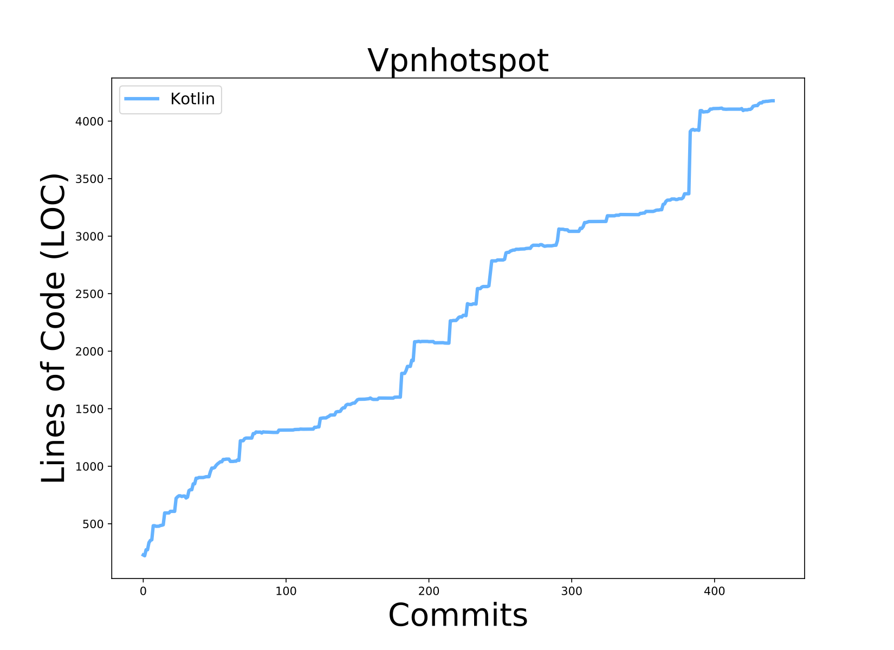

[back to the top](#codevolution)

## ET 2: Kotlin code replaces all Java code 

[back to the top](#codevolution)

## ET 3: Kotlin code replaces all Java code 

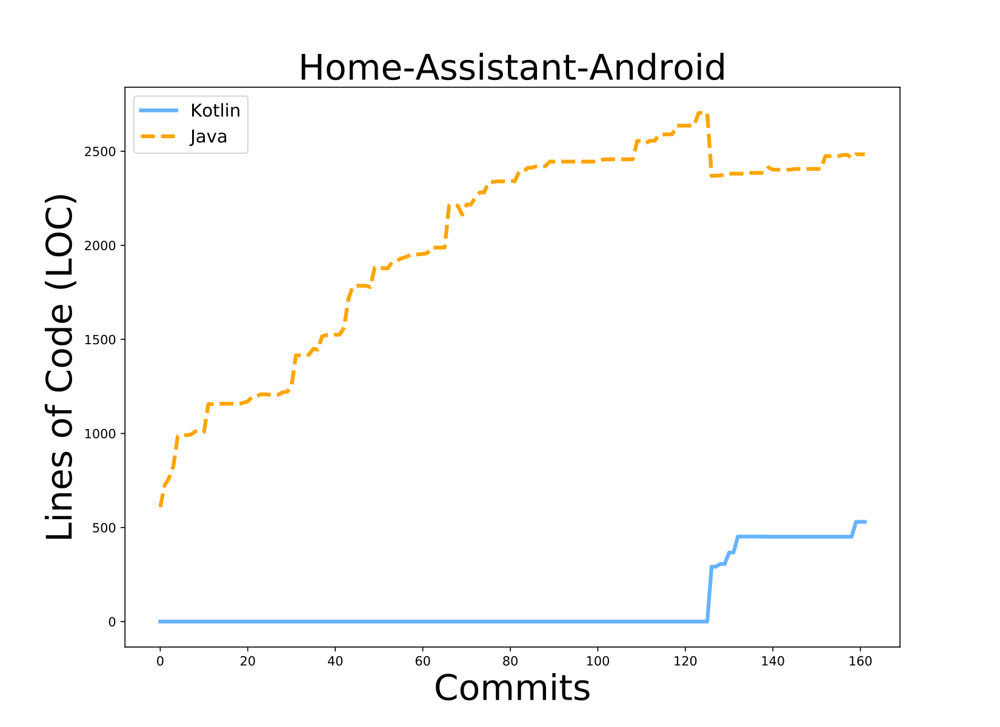

[back to the top](#codevolution)

## ET 4: Kotlin increase together with Java 

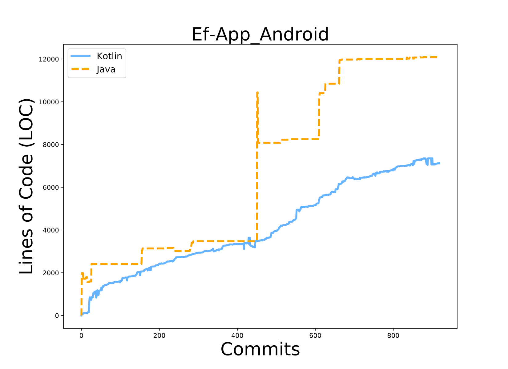

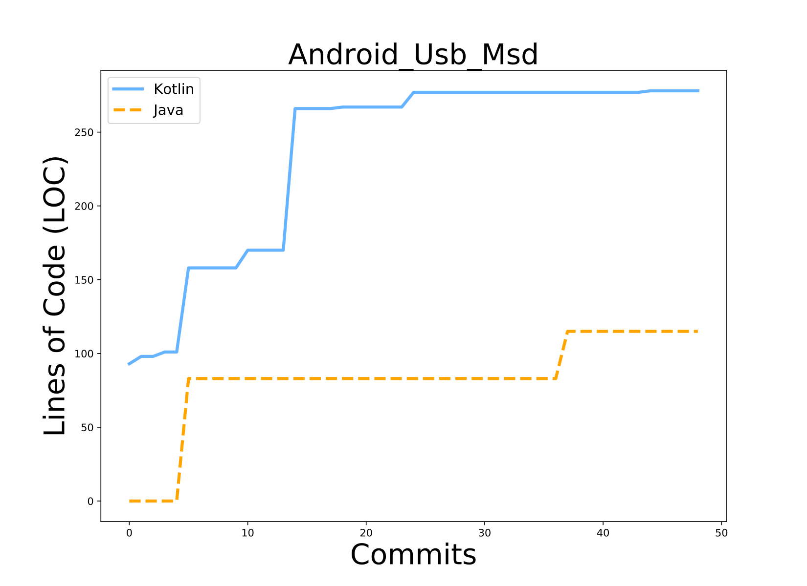

[back to the top](#codevolution)

## ET 5: Kotlin grows and Java decreases (but never is zero)

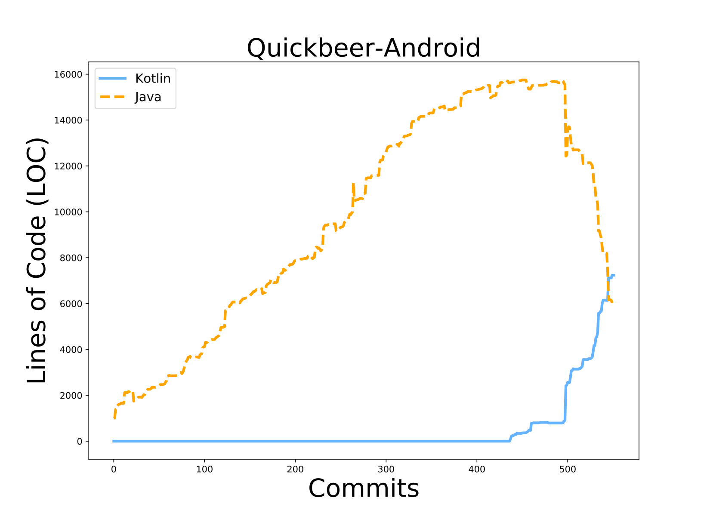

[back to the top](#codevolution)

## ET 6: Kotlin grows and Java decreases until the Java code is 0

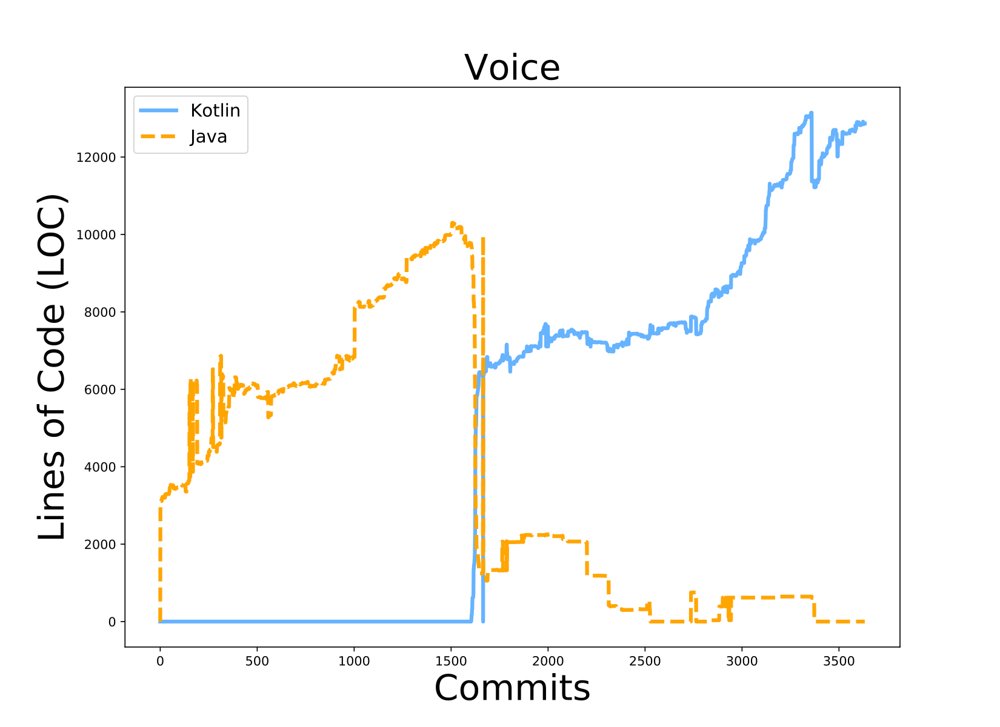

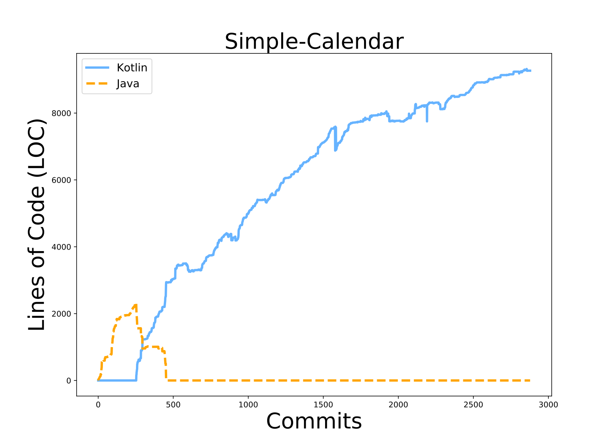

[back to the top](#codevolution)

## ET 7: Kotlin grows and Java remains constant

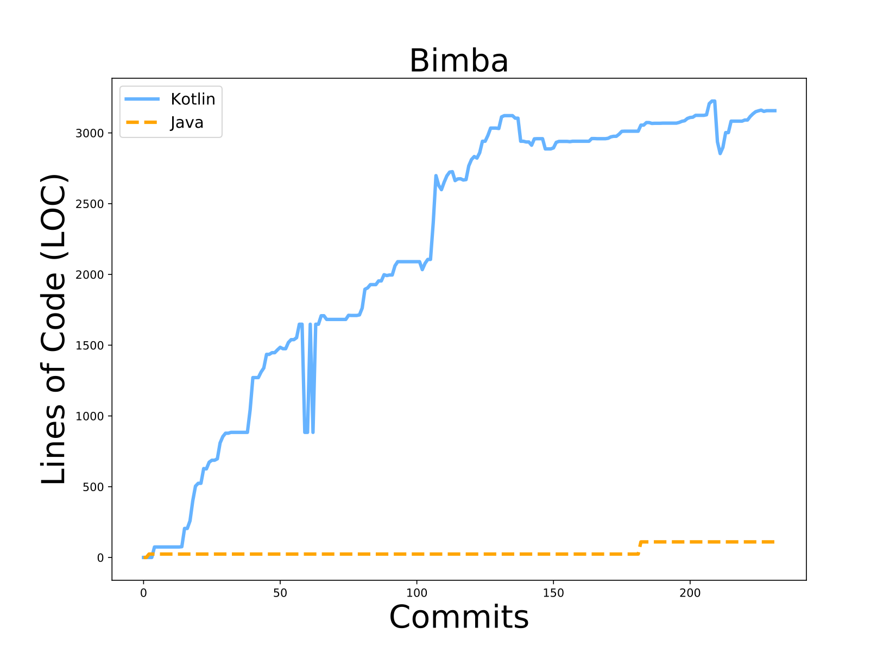

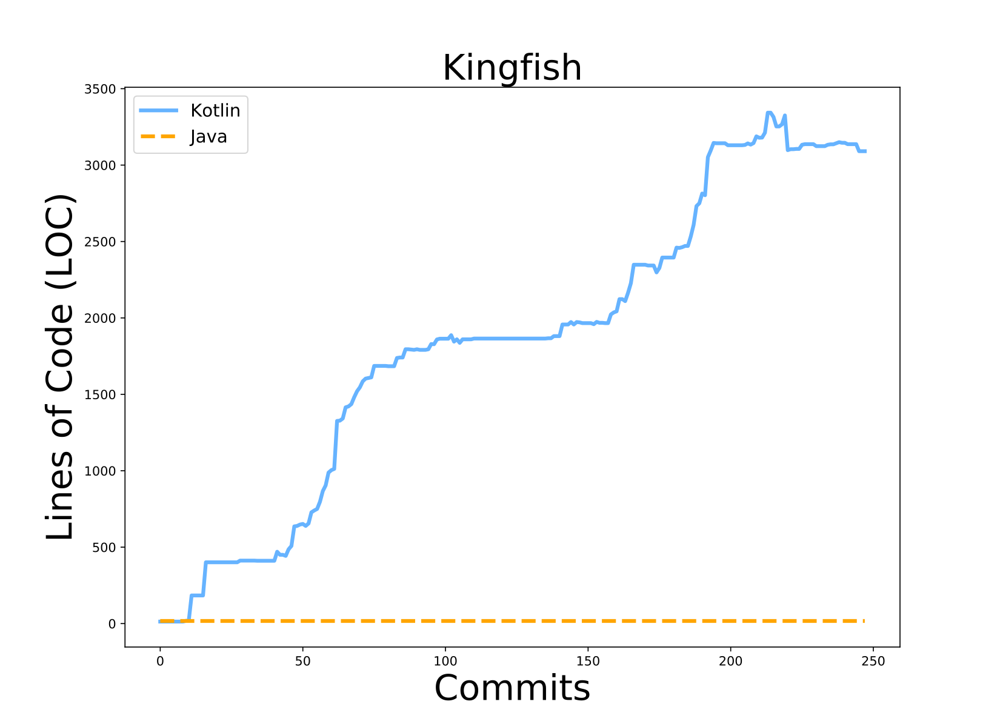

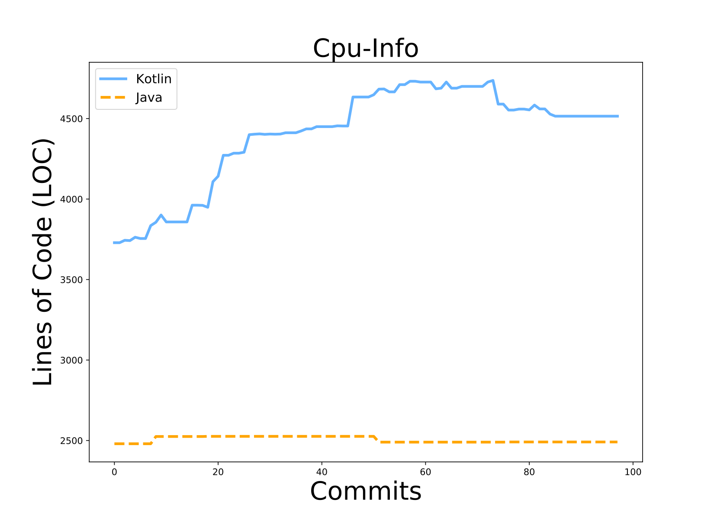

[back to the top](#codevolution)

## ET 8: Kotlin is constant and Java changes

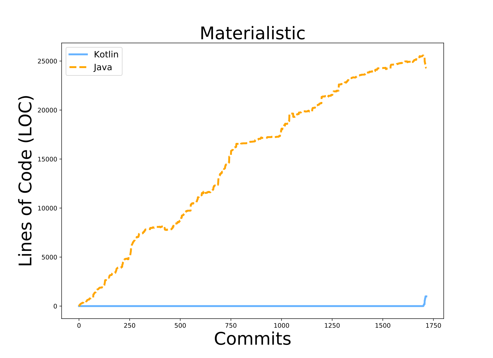

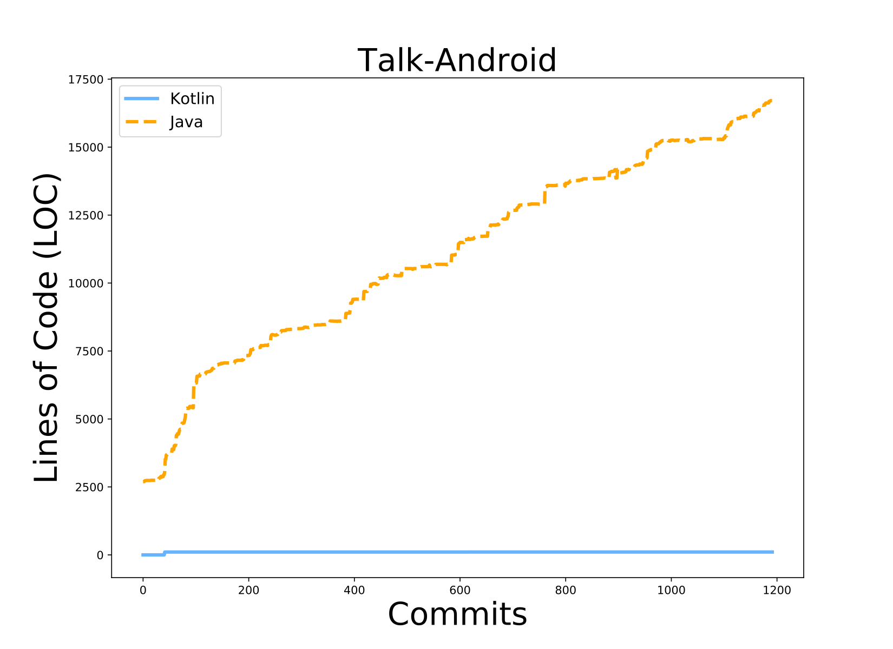

[back to the top](#codevolution)

## ET 9: Kotlin and Java remain constant

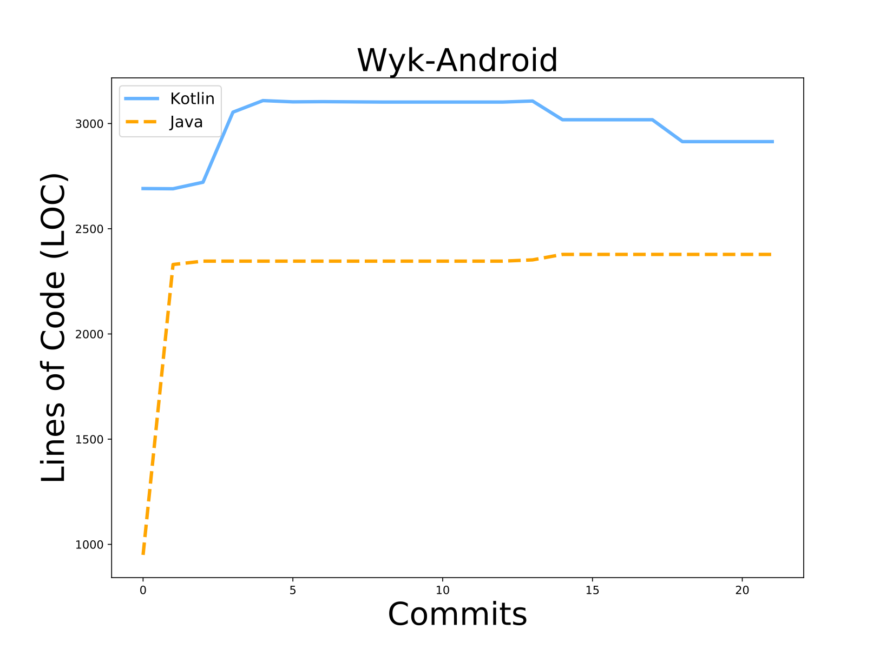

[back to the top](#codevolution)

## ET 10: Kotlin introduced but lately disappears

[back to the top](#codevolution)

## ET 11: Java replaces Kotlin code

[back to the top](#codevolution)

## ET 12: Other

[back to the top](#codevolution)

